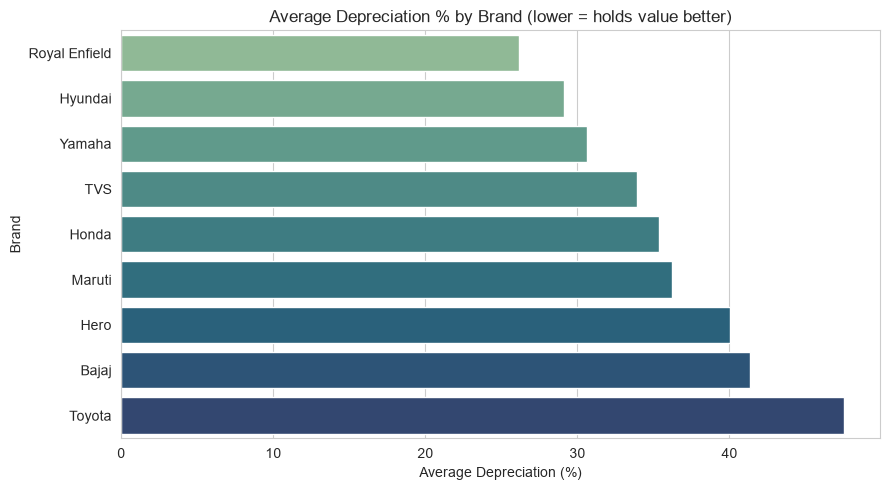
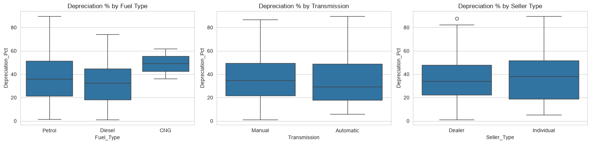
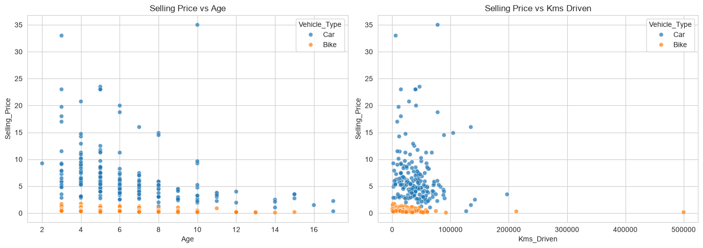
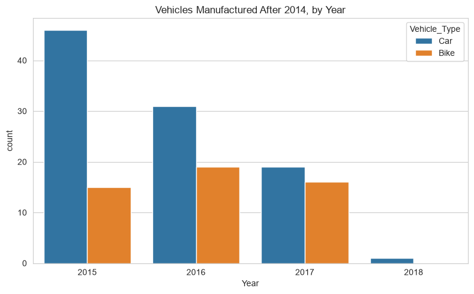

# 🚗 Car Market Trends Analysis — CarDekho Dataset


> **A practical exploratory data analysis of 301 used-vehicle listings, focused on pricing, depreciation, vehicle age, mileage, and identifying listings that outperform a simple pricing expectation.**

---

## 📌 Project Info

| | |
|---|---|
| **Author** | Chitranjan Vishwakarma |
| **Course** | BCA (Bachelor of Computer Applications) |
| **College** | Sri Ram Kishun P.G. College, Gokul, Karsada, Varanasi |
| **AICTE Student ID** | STU6a6aca966acaf1785383574 |
| **Project Type** | VOIS DIY Project |
| **Dataset** | CarDekho used-vehicle listings |
| **Analysis** | 25 structured questions |

---

## 📖 About the Project

Buying a used vehicle involves more than looking at its asking price. Vehicle age, original price, mileage, brand, transmission, seller type, and ownership history can all be associated with resale value.

This project analyzes a **CarDekho used-vehicle dataset containing 301 listings** and answers **25 structured questions** covering:

- Vehicle and dataset profiling
- Selling-price ranges
- Vehicle frequency and model diversity
- Depreciation and resale-value behavior
- Factors associated with depreciation
- Age and mileage relationships with selling price
- Newer vehicles manufactured after 2014
- Two-wheeler-specific analysis
- Car-specific analysis
- Simple regression-based identification of vehicles that sold above expected price

### 🔍 The interesting data challenge

The raw dataset does **not** contain a dedicated `Vehicle_Type` column. Cars and bikes are mixed together under `Car_Name`.

To answer the car/bike-specific questions, the notebook creates a `Vehicle_Type` feature from the vehicle/model names. It then adds:

- `Age`
- `Depreciation`
- `Depreciation_Pct`
- `Brand`

This feature engineering step makes the later car-vs-bike analysis possible.

---

# 📊 Dataset Overview

| Metric | Value |
|---|---:|
| Total records | **301** |
| Unique vehicle models | **98** |
| Cars | **200** |
| Bikes | **101** |
| Manufacturing years | **2003–2018** |
| Missing values | **0** |
| Exact duplicate rows | **2** |
| Lowest selling price | **₹0.10 lakh** |
| Highest selling price | **₹35.00 lakh** |

### Original variables

```text
Car_Name
Year
Selling_Price
Present_Price
Kms_Driven
Fuel_Type
Seller_Type
Transmission
Owner
```

### Engineered variables

```text
Vehicle_Type
Age
Depreciation
Depreciation_Pct
Brand
```

---

# ❓ 25 Questions Answered

The notebook is organized into four analytical sections.

### 1️⃣ Data Overview — Q1 to Q11

- Manufacturing-year range
- Lowest and highest selling price
- Number of records
- Missing values and duplicates
- Number of unique vehicle models
- Most-listed vehicle
- CNG availability
- Individual sellers
- Automatic transmission
- Single-owner vehicles

### 2️⃣ Depreciation & Pricing Factors — Q12 to Q16

- Most and least depreciated vehicles
- Brands with lower average depreciation
- Factors associated with depreciation
- Relationship between selling price, age, and mileage
- Vehicles manufactured after 2014

### 3️⃣ Two-Wheeler Deep Dive — Q17 to Q21

- Extracting bike-only records
- Oldest bike
- Newest bike
- Most-listed bike
- Bikes that sold above a simple model-based expectation

### 4️⃣ Car Deep Dive — Q22 to Q25

- Extracting car-only records
- Oldest car
- Newest car
- Cars that sold above a simple model-based expectation

---

# 📈 Visual Analysis

The following visuals are **directly extracted from the charts generated in the Jupyter notebook**.

## 1. Average Depreciation by Brand

The brand-level comparison shows large differences in average depreciation percentage.

<p align="center">
  
</p>

### Brand-level result

| Brand | Avg. Depreciation % |
|---|---:|
| **Royal Enfield** | **26.14%** |
| Hyundai | 29.15% |
| Yamaha | 30.65% |
| TVS | 33.89% |
| Honda | 35.34% |
| Maruti | 36.22% |
| Hero | 40.03% |
| Bajaj | 41.38% |
| **Toyota** | **47.52%** |

> Lower depreciation percentage means the brand retained a larger share of its present price in this dataset.

---

## 2. Depreciation Across Fuel, Transmission & Seller Type

The notebook compares depreciation distributions across three categorical factors:

<p align="center">
  
</p>

The analysis does not treat these categories as causal drivers. They are used to compare the observed depreciation distributions in the dataset.

---

## 3. Selling Price vs Vehicle Age & Mileage

<p align="center">
  
</p>

The notebook reports:

| Relationship | Correlation |
|---|---:|
| Selling Price ↔ Age | **−0.236** |
| Selling Price ↔ Kms Driven | **0.029** |

### Interpretation

The relationship between selling price and age is moderately negative in this dataset: older vehicles tend to have lower selling prices.

The direct linear correlation between selling price and kilometers driven is very weak in this dataset. This means mileage alone does not explain much of the observed selling-price variation.

> **Correlation is an association measure, not proof of causation.**

---

## 4. Vehicles Manufactured After 2014

<p align="center">
  
</p>

The notebook finds:

- **147 of 301** vehicles were manufactured after 2014.
- **97 cars**
- **50 bikes**
- Average selling price of vehicles manufactured after 2014: **₹5.77 lakh**
- Average selling price of vehicles manufactured in 2014 or earlier: **₹3.60 lakh**

This provides a clear descriptive difference between newer and older listings in the dataset.

---

# 💰 Depreciation Analysis

## Most vs Least Depreciated

### Highest depreciation percentage

**Toyota Camry — 2006**

- Present Price: **₹23.73 lakh**
- Selling Price: **₹2.50 lakh**
- Depreciation: **89.46%**

### Lowest depreciation percentage

**Toyota Corolla Altis — 2016**

- Present Price: **₹14.89 lakh**
- Selling Price: **₹14.73 lakh**
- Depreciation: **1.07%**

---

## 📉 What is Associated with Depreciation?

The notebook calculates correlations with `Depreciation_Pct`:

| Variable | Correlation with Depreciation % |
|---|---:|
| **Age** | **0.849** |
| **Kms_Driven** | **0.506** |
| Owner | 0.223 |
| Present_Price | 0.102 |

### Main takeaway

**Vehicle age is the strongest observed numeric association with depreciation percentage**, followed by kilometers driven.

This does not mean age or mileage independently causes a specific depreciation percentage; other vehicle characteristics and market factors are not controlled for in this exploratory analysis.

---

# 🏆 Key Findings

### 01 — The dataset contains both cars and bikes

There are **200 cars and 101 bikes**, but the original data does not explicitly label vehicle type. The notebook therefore creates the `Vehicle_Type` feature from model names.

### 02 — Vehicle age is strongly associated with depreciation

The correlation between `Age` and `Depreciation_Pct` is **0.849**, substantially stronger than the relationship with kilometers driven.

### 03 — Mileage alone has little linear relationship with selling price

`Selling_Price` and `Kms_Driven` have a correlation of only **0.029** in this dataset.

### 04 — Newer vehicles command higher average selling prices

Vehicles manufactured after 2014 average **₹5.77 lakh**, compared with **₹3.60 lakh** for vehicles manufactured in 2014 or earlier.

### 05 — Royal Enfield shows the lowest average depreciation

Royal Enfield has the lowest average depreciation percentage among the brands analyzed at **26.14%**, while Toyota has the highest at **47.52%**.

### 06 — The dataset contains a small number of CNG vehicles

Only **2 listings** use CNG:

- Wagon R — 2015
- SX4 — 2011

### 07 — Single-owner vehicles dominate the dataset

`Owner = 0` represents a single/first-hand owner in the notebook's interpretation. There are **290 such listings**.

### 08 — Some vehicles outperform the general pricing pattern

A simple linear regression using `Present_Price`, `Age`, and `Kms_Driven` is used to estimate an expected selling price.

The difference:

```text
Residual = Actual Selling Price − Predicted Selling Price
```

A positive residual indicates a vehicle sold above the model's general expectation.

---

# 🏍️ Two-Wheeler Analysis

The notebook identifies **101 two-wheeler records**.

### Oldest bike

**Hero Super Splendor**

- Manufacturing year: **2005**
- Selling price: **₹0.20 lakh**

### Newest bike

**UM Renegade Mojave**

- Manufacturing year: **2017**
- Selling price: **₹1.70 lakh**

### Most-listed bike

**Royal Enfield Classic 350**

- **7 listings**

### Bikes with the largest positive residuals

| Vehicle | Actual Selling Price | Predicted Price | Residual |
|---|---:|---:|---:|
| Royal Enfield Thunder 500 | ₹1.75L | ₹1.29L | **+₹0.46L** |
| UM Renegade Mojave | ₹1.70L | ₹1.30L | **+₹0.40L** |
| KTM RC200 | ₹1.65L | ₹1.27L | **+₹0.38L** |
| Royal Enfield Thunder 350 | ₹1.25L | ₹0.91L | **+₹0.34L** |
| Bajaj Dominar 400 | ₹1.45L | ₹1.17L | **+₹0.28L** |

These are **model-based outliers**, not proof that the vehicles were objectively better deals.

---

# 🚘 Car Analysis

The notebook identifies **200 car records**.

### Oldest car

**800**

- Manufacturing year: **2003**
- Selling price: **₹0.35 lakh**

### Newest car

**Vitara Brezza**

- Manufacturing year: **2018**
- Selling price: **₹9.25 lakh**

### Cars with large positive residuals

| Vehicle | Actual Selling Price | Predicted Price | Residual |
|---|---:|---:|---:|
| Fortuner — 2017 | ₹33.00L | ₹22.01L | **+₹10.99L** |
| Innova — 2017 | ₹23.00L | ₹16.42L | **+₹6.58L** |
| 800 — 2003 | ₹0.35L | −₹5.46L | **+₹5.81L** |
| Fortuner — 2015 | ₹23.00L | ₹17.44L | **+₹5.56L** |

The Fortuner and Innova listings show particularly large positive residuals, meaning their observed selling prices were substantially higher than the simple regression model expected.

---

# 🧮 Methodology

## 1. Data Loading

The dataset is loaded using Pandas.

```python
df = pd.read_csv(
    "Car_Market_Trends_Analysis_with_Car_Dekho_Data.csv"
)
```

## 2. Feature Engineering

The notebook creates:

```text
Vehicle_Type
Age
Depreciation
Depreciation_Pct
Brand
```

### Depreciation

```text
Depreciation = Present_Price − Selling_Price
```

### Depreciation Percentage

```text
Depreciation_Pct =
(Present_Price − Selling_Price) / Present_Price × 100
```

### Vehicle Age

```text
Age = 2020 − Year
```

---

## 3. Exploratory Data Analysis

The project uses:

- `head()`
- `info()`
- missing-value checks
- duplicate checks
- `value_counts()`
- `groupby()`
- correlations
- descriptive statistics
- categorical comparisons

---

## 4. Expected-Price Analysis

For the car and bike subsets, the notebook fits a simple linear regression using:

```text
Selling_Price ~ Present_Price + Age + Kms_Driven
```

The predicted price is compared with the actual selling price.

```text
Residual = Actual Price − Predicted Price
```

Large positive residuals are treated as vehicles that sold above the general expectation of the simple model.

---

# 🛠️ Tech Stack

| Technology | Purpose |
|---|---|
| **Python 3** | Core programming language |
| **Pandas** | Data loading, cleaning, transformation and analysis |
| **NumPy** | Numerical computation and regression calculations |
| **Matplotlib** | Data visualization |
| **Seaborn** | Statistical charts and plots |
| **Jupyter Notebook** | Interactive analysis environment |

---

# 📁 Project Structure

```text
Car-Market-Trends-Analysis/
│
├── car_market_trends_analysis.ipynb
├── Car_Market_Trends_Analysis_with_Car_Dekho_Data.csv
├── car_market_trends_analysis.pdf
├── Car_Market_Trends_Analysis_PPT.pptx
├── README.md
│
└── assets/
    ├── 01_brand_depreciation.png
    ├── 02_depreciation_factors.png
    ├── 03_selling_price_relationships.png
    └── 04_newer_vehicles_distribution.png
```

---

# ▶️ How to Run

### 1. Install Python dependencies

```bash
pip install pandas numpy matplotlib seaborn jupyter
```

### 2. Keep the notebook and dataset together

```text
car_market_trends_analysis.ipynb
Car_Market_Trends_Analysis_with_Car_Dekho_Data.csv
```

### 3. Launch Jupyter

```bash
jupyter notebook
```

### 4. Open the notebook

```text
car_market_trends_analysis.ipynb
```

Run the notebook cells from top to bottom.

---

# ⚠️ Analytical Notes & Limitations

- This is an **exploratory analysis**, not a production-grade vehicle valuation system.
- `Vehicle_Type` is inferred from vehicle/model names because the source dataset does not contain a dedicated vehicle-type field.
- The dataset contains **2 exact duplicate rows**, which are identified in the notebook.
- Correlation measures association and does not establish causality.
- The expected-price analysis uses a **simple linear regression**, so it should not be interpreted as a professional market-pricing model.
- Brand reputation, condition, service history, accident history, location, demand, and other potentially important resale factors are not modeled.
- Some individual model-based outliers may be influenced by characteristics not represented in the available variables.

---

# 🎓 Skills Demonstrated

### Data Analysis
- Data inspection
- Data-quality checking
- Feature engineering
- Missing-value analysis
- Duplicate detection
- Grouped aggregation
- Correlation analysis
- Subset analysis

### Data Visualization
- Bar charts
- Box plots
- Scatter plots
- Count plots
- Comparative visual analysis

### Analytical Modeling
- Linear regression using NumPy
- Predicted-vs-actual comparison
- Residual analysis
- Outlier identification

### Business Thinking
- Depreciation analysis
- Resale-value comparison
- Vehicle segmentation
- Pricing-pattern analysis
- Used-vehicle deal detection

---

# 🙌 Acknowledgements

Dataset sourced from **CarDekho used-vehicle listings** and analyzed as part of a **VOIS DIY project assignment**.

---

## 👨‍💻 Author

**Chitranjan Vishwakarma**  
BCA — Sri Ram Kishun P.G. College, Gokul, Karsada, Varanasi

**VOIS DIY Project — Car Market Trends Analysis**

---

<p align="center">
  <strong>🚗 Turning used-vehicle data into actionable market insights.</strong>
</p>

<p align="center">
  ⭐ If you found this analysis useful, feel free to star the repository.
</p>
